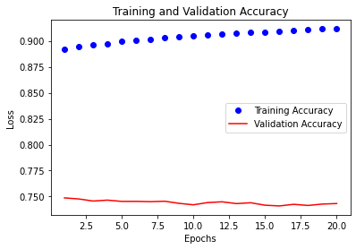
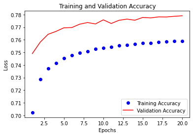
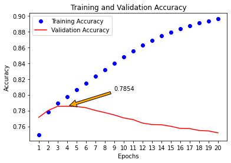
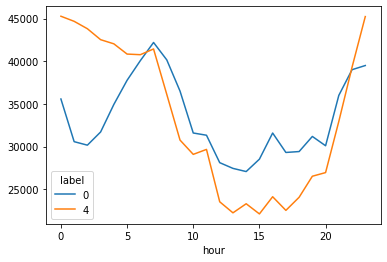
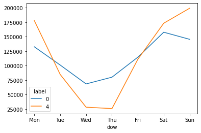

# Twitter Sentiment Analysis


In this project I want to compare two models **Naïve Bayes** and **RNN-LSTM** to conduct Sentiment Analysis . Sentiment analysis is a branch of Natural Language Process that analyses a given piece of text and predicts whether this piece of text expresses positive or negative sentiment.

The dataset is named sentiment140, created by researcher from Sandford University. The link for their dataset: http://help.sentiment140.com/home

The way they collected tweets is described in this paper: https://cs.stanford.edu/people/alecmgo/papers/TwitterDistantSupervision09.pdf, basically what they did, quoting their own words is:

> *Our approach was unique because our training data was automatically created, as opposed to having humans manual annotate tweets. In our approach, we assume that any tweet with positive emoticons, like :), were positive, and tweets with negative emoticons, like :(, were negative. We used the Twitter Search API to collect these tweets by using keyword search*

This means we have a balanced dataset with 800k positive tweets, and 800k negative tweets, combining as a 1.6 millions dataset.


### Final Results:

0 -> negative; 1 -> positive

**Naïve Bayes:** (clearly overfitting, bad performance)

```
Accuracy on train data: 0.9300671875
Accuracy on test data: 0.6442375

Confusion matrix:

Predicted	0	    1	    All
Actual			
0	        173874	4536	178410
1	        109308	32282	141590
All	        283182	36818	320000
```


**RNN-LSTM** (more consistent results than Naïve Bayes)


No regularization (dropout): model overfits, validation accuracy around 75%



With regularization (dropout layers): improved slightly, 78% accuracy



Furthering cleaning noisy words: best model, 78.5% at 4th epoch




## Walk Through the Project


### Download Dataset

You can use Kaggle CLI tool to download the dataset and save in the project data/ folder

```
kaggle datasets download -d kazanova/sentiment140

unzip sentiment140.zip -d data/
```

Or, manually download data from: https://www.kaggle.com/kazanova/sentiment140


### Exploratory Data Analysis

Notebook Link: https://georgehua.github.io/twitter-sentiment-analysis/EDA.html

Key findings:

- **1.6 millions** data entries
- Text data is not clean, wrong spelling words, special characters, etc. Need to clean the data.
- 800k negative, 800k positive, so the data is well balanced (good news)
- Most frequent words in positive tweets: "lol", "think", "love", "haha"
- Most frequent words in negative tweets: "think", "miss", "work", "still"

Besides the analysis of textual data, I found there're relationship between the post time and the sentiment.


Number of tweets by each hours of the day (0 -> negative, 4 -> positive, time zone not clear)



- There's a specific interval of time in which positive tweets outnumber the negative tweets, and another interval in which the opposite occurs.
- When the total number of tweets is relatively high, the majority of the tweets tend to have a positive sentiment. This *could* also mean that positive tweets come in big batches, maybe relating to a similar subject (soccer game, movie release, etc.), whereas negative tweets are more sparsely distributed.


Number of tweets by each weekday (0 -> negative, 4 -> positive, time zone not clear)



- People tend to tweet more positively during the weekends, when they relax and attend events, whereas negative tweets are dominant during the rest of the week, showcasing people's dissatisfaction with their work.
- A much bigger number of tweets is circulated during the weekend, relative to the rest of the week.


### Data Preprocessing

- Drop unnecessary columns, and only keep label and text
- Tokenize the text input with TweetTokenizer (from nltk package, specialized for tweets, such as preserving hashtags)
- Lemmatization that extracts the stem of words and parts of speech
- Drop stop words
- Normalize English slangs or abbreviations
- Remove "noises" (HTML tags, special characters, URLs, user mentions ie. "@someone")


## Modeling

Notebook Link: https://georgehua.github.io/twitter-sentiment-analysis/Modeling.html


Before running the two models, I train-test split the dataset by 80%, 20%.


### Naïve Bayesian Model

One of the most commonly used classification models in Natural Language Processing (NLP) is the Naïve Bayesian.
**Naïve Bayesian** classifiers are a collection of classification algorithms based on Bayes’ Theorem. It is not a single algorithm but rather a family of algorithms where all of them make the following *naïve* assumptions:

- All features are independent from each other.
- Every feature contributes equally to the output.


**Results**

```
Accuracy on train data: 0.9300671875
Accuracy on test data: 0.6442375
```

We achieved 93% accuracy on the train set, while 64% on the testing set, which is clearly an overfitting model.

```
Most Informative Features
                     nks = True                1 : 0      =    102.0 : 1.0
                    dmed = True                1 : 0      =     56.7 : 1.0
                timeless = True                1 : 0      =     56.7 : 1.0
                  thanxx = True                1 : 0      =     56.7 : 1.0
                  reblip = True                1 : 0      =     56.7 : 1.0
               giveaways = True                1 : 0      =     56.7 : 1.0
```

Taking a look at the 6 most informative features of the model, we can notice the high volume of positive to negative (1:0) informative features. This is very interesting as it means that positive tweets have a much more concentrated and limited vocabulary when compared to negative tweets.


**Testing with custom tweets:**

```
custom_tweet = "The reward for good work is more work!"

custom_tokens = remove_noise(tk.tokenize(custom_tweet))

print(classifier.classify(dict([token, True] for token in custom_tokens)))
```

Return: 0 (correct)

```
custom_tweet = "I loved the show today! It was amazing and a wonderful day."

custom_tokens = remove_noise(tk.tokenize(custom_tweet))

print(classifier.classify(dict([token, True] for token in custom_tokens)))
```

Return: 1 (correct)


### RNN-LSTM

A **L**ong **S**hort-**T**erm **M**emory, or **LSTM**, is a type of machine learning neural networks. More specifically, it belongs to the family of **R**ecurrent **N**eural **N**etworks (**RNN**) in Deep Learning, which are specifically conceived in order to process *temporal data*.


In this section, I implemented the following process to build a LSTM model, detailed in the notebook (https://georgehua.github.io/twitter-sentiment-analysis/Modeling.html#head-3):


**Word Embeddings**

Word embeddings are a way for us to convert words to *representational vectors*, which created a meaning representation of words and feed into the RNN model.


**Global Vectors for Word Representation (GloVe)**

For building a word embedding we can use the library GloVe, it's robust and accurate. Alternative choice is word2vec, which is also very popular.


**Data Padding**

Further in our training we would like to speed the process up by splitting data into *mini-batches*. However, and in order to be able to utilize batch learning, keras (and similarly to most machine learning frameworks) requires all data within the same batch to have the same length or *dimension*. 


**Building Model with Keras**

```
model = Sequential()

model.add(pretrained_embedding_layer(word_to_vec_map, word_to_index, max_len))
model.add(Bidirectional(LSTM(units=128, return_sequences=True)))
model.add(Bidirectional(LSTM(units=128, return_sequences=False)))
model.add(Dense(units=1, activation='sigmoid'))
```


**Adding Dropout layers (Regularization)**

**Regularization** is the process of preventing a model from over-fitting the training data. **Dropout** is one of the many regularization techniques, and also one of the simplest to implement and most commonly used. 

```
model_dropout = Sequential()

model_dropout.add(pretrained_embedding_layer(word_to_vec_map, word_to_index, max_len))
model_dropout.add(Dropout(rate=0.4))
model_dropout.add(Bidirectional(LSTM(units=128, return_sequences=True)))
model_dropout.add(Dropout(rate=0.4))
model_dropout.add(Bidirectional(LSTM(units=128, return_sequences=False)))
model_dropout.add(Dense(units=1, activation='sigmoid'))
```


**Train model with GPU** **for 20 epochs with batch size of 20**

```
with tf.device('/device:GPU:0'):
    model.fit(X_train, Y_train, validation_data=(X_test, Y_test), epochs = 20, batch_size = 128, shuffle=True)
```


What's worth mentioning is, after I trained the initial LSTM model, I found there're a lot of unknown words that are not recognizable to GloVe representation. So I checked those words and see how they look like:

```
[("i'm", 122237),
 ("can't", 44971),
 ("i'l", 25069),
 ("that's", 21660),
 ("i've", 19508),
 ("he's", 7943),
 ("i'd", 7589),
 ('hahaha', 7190),
 ("we're", 6409),
 ("there's", 5874)
]
```

We can observe that most of the unknown words are very common words, however the word embeddings layer does not support quotes. For example, if you try to get the index of the word "i'm", you'll be prompted with a key error, whereas the word "im" is available as a valid key. Other words, such as "idk", "lmao" or "b-day" reminds us that our data comes from twitter, and we'll have to individually handle each of these words such that our words embedding layer recognize them.

Therefore, I set up the further text cleaning with arbitrary rules to correct those words. Then retrained the LSTM model. Eventually I obtained a model with 78.5% accuracy on testing set.


**How does wrong predictions look like?**

```
Expected sentiment: 1. Input: headache love morning 
Expected sentiment: 0. Input: hear hour work day cool 
Expected sentiment: 0. Input: dear web host please release site purgatory provide unk unk 
Expected sentiment: 0. Input: get away mp3 garbage dont people know mp3s sound like crap 
Expected sentiment: 1. Input: frustrate want eat get fat 
Expected sentiment: 1. Input: get talk bo super unk life haha julie 
Expected sentiment: 0. Input: twitter crackberry still no-go 
Expected sentiment: 0. Input: back vacation want disney world 
Expected sentiment: 1. Input: mean 
Expected sentiment: 1. Input: whats goin unk tell something good aint follow unk active unk 
Expected sentiment: 1. Input: photobucket time yes scar unk 
Expected sentiment: 0. Input: really point watch cedric die 
Expected sentiment: 1. Input: im get unk work today stay 1am tonight 
Expected sentiment: 1. Input: im sorry feel well genesis serpent take way calvary good 
```

Skimming through the above output, we can "understand" why the model wouldn't properly classify several examples. Some examples seem wrongly labeled in the first place, whereas some other examples are really hard to classify without further context.

So all in all, I would say that our current model is relatively robust in classifying the sentiment in a given sentence!


## Further Work

- Further data cleaning and re-labelling. As the data origin is from twitter, it is expected to contain a wide range of not "official" English words, so data cleaning is crucial in such a scenario. Furthermore, as the data labelling has been done automatically based on the reactions of the tweet, this labelling is by no means perfect and a human re-labelling of the whole data would certainly be beneficial.
- Introduce a neutral class, transforming the problem to a multi-class classification problem.
- Try out several other word embeddings or model architectures.
- Augment the data by diversifying it in order to make the model more robust, especially against sarcasm.


## Project Structure


    ├── README.md             <- The top-level README for developers using this project.
    ├── data
    │   ├── cleaned.npy       <- cleaned numpy data file for modeling
    │   ├── glove.6B.50d.txt  <- GloVe trained model
    │
    ├── docs                  <- Github Pages documents
    │
    ├── figures               <- Figures in the notebook or docs
    │
    ├── notebook              <- Jupyter notebooks for EDA and experiments
    │
    ├── requirements.txt      <- The requirements file for reproducing the analysis environment, e.g.
    │                            generated with `pip freeze > requirements.txt`


------------


